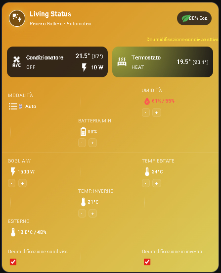
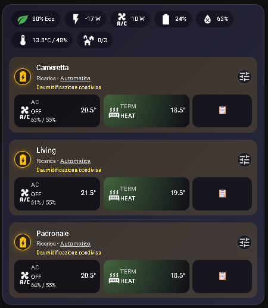

# ☀️ Energy Smart PV Climate

**Energy Smart PV Climate** is a Home Assistant integration designed to orchestrate your photovoltaic system, home battery, and HVAC units into a single, intelligent ecosystem. 

The primary goal is to maximize self-consumption, protect your battery life, and maintain thermal comfort without manual intervention.

---

## 🚀 Key Features

* **⚡ PV Surplus Management:** Automatically triggers AC units based on excess solar energy exported to the grid.
* **🔋 Battery Protection:** Prevents unnecessary discharge cycles by blocking boosts if the battery level is below a configurable threshold.
* **💧 Smart Dehumidification:** Controls indoor humidity using hysteresis and intelligent logic for multi-split systems.
* **🌡️ Adaptive Offset:** Automatically adjusts the summer target temperature based on outdoor conditions.
* **🤖 Multi-Split Sync:** Uses a "voting" algorithm to prevent mode conflicts (e.g., heating vs cooling) on shared outdoor units.
* **📊 Dedicated UI:** Includes two custom Lovelace cards for granular or centralized control.

---

## 🏗️ System Architecture

The integration creates several entities for each configured **Zone** (e.g., Living Room, Bedroom):

| Entity | Description |
| :--- | :--- |
| `switch.<zone>_auto_mode` | Enables/disables the automation for that specific zone. |
| `select.<zone>_mode` | Season selector: `Summer (Cooling)`, `Winter (Heating)`, or `Auto`. |
| `sensor.<zone>_status` | Operational status (Boosting, Charging Battery, Idle, etc.). |
| `sensor.<zone>_surplus_power` | Real-time calculation of available surplus power for the zone. |

---

## 🛠️ Installation

### 1. Copy Files
Copy the `custom_components/energy_smart_pv_climate` folder into your Home Assistant `custom_components` directory.

Copy the JS card files (`energy-smart-pv-card.js` and `energy-smart-pv-unified-card.js`) into your `www` folder (e.g., `/config/www/energy_smart_pv/`).

### 2. Frontend Configuration
Add the following resources under **Settings > Dashboards > Resources**:
* `/local/energy_smart_pv/energy-smart-pv-card.js` (JavaScript Module)
* `/local/energy_smart_pv/energy-smart-pv-unified-card.js` (JavaScript Module)

### 3. Integration Setup
Go to **Settings > Devices & Services > Add Integration** and search for `Energy Smart PV Climate`.
* **First Zone:** Configure global sensors (Grid, Battery, Weather).
* **Subsequent Zones:** Global sensors are automatically inherited.

---

## 🧠 Control Logic

### Energy Management
* **Boost:** Activates if surplus exceeds the `export_threshold`.
* **Shutdown:** Deactivates if surplus drops below 100W (enforcing a 5-minute anti-short cycle protection).
* **Battery Priority:** If the battery level falls below `min_battery_level`, the AC is turned off immediately to prioritize charging.

### Multi-Split Logic (Smart Voting)
For shared outdoor units, the system resolves conflicts:
1.  **Voting:** Zones "vote" for `HEAT` or `DRY/COOL` based on local humidity sensors.
2.  **Winter Veto:** If "Winter Dehumidification" is disabled for even one zone, the entire group is blocked from cooling/drying in winter to prevent unwanted temperature drops.

---
## 🖼️ User Interface (Lovelace)

### Single-Zone Card
Provides detailed status for a single room, allowing you to adjust humidity thresholds, battery limits, and toggle sharing flags.

### Unified Card
A compact dashboard for whole-house monitoring, featuring a global "Eco Score" and quick access to all zone parameters.

---

## 🤝 Contributing
Pull requests are welcome! For major changes, please open an issue first to discuss what you would like to change.

---

*Developed with ❤️ to optimize your self-consumption.*
